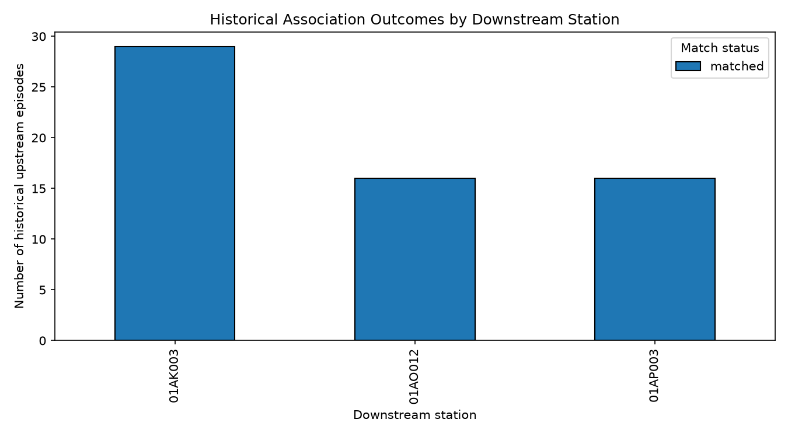
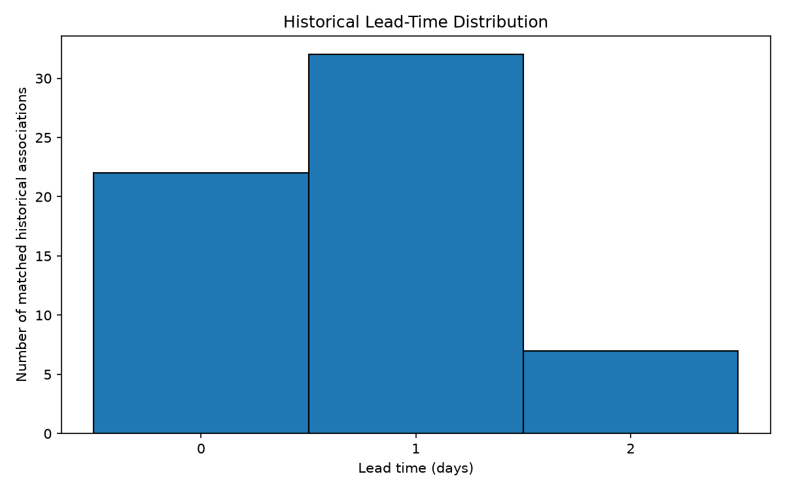
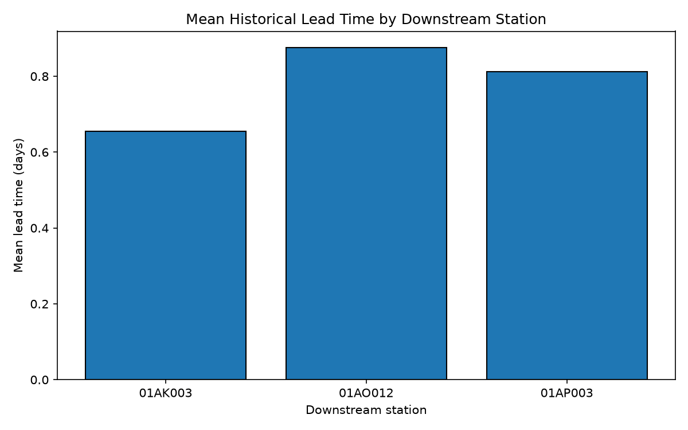
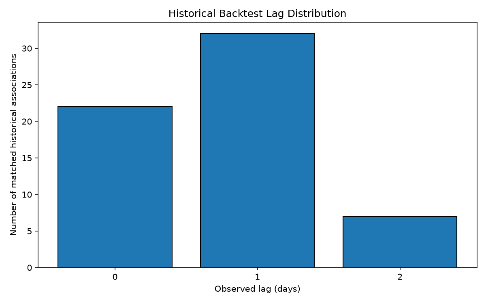

# HydroLens

[](https://github.com/mehrabali121/HydroLens/actions/workflows/ci.yml)

**Historical River Rise & Lead-Time Analytics**

**Live Dashboard:** https://hydro-lens.streamlit.app/

HydroLens is a reproducible Python and SQL data-analysis pipeline with an interactive Streamlit dashboard for investigating historical water-level rise events and upstream/downstream temporal relationships between hydrometric monitoring stations in the Saint John River basin.

The project detects historical water-level rise events, groups them into episodes, examines upstream/downstream temporal associations, summarizes observed lead times in matched historical cases, and presents the results through an interactive dashboard.

This is an academic portfolio project. It is not an operational flood-warning, forecasting, or emergency-response system.

## Interactive Dashboard

The public HydroLens dashboard is available at:

**https://hydro-lens.streamlit.app/**

The dashboard provides:

- high-level historical analysis metrics
- interactive downstream-station exploration
- station-level matched episode statistics
- interactive comparison of downstream stations
- historical lead-time visualizations
- historical association outcomes
- historical backtest results
- methodology and interpretation limitations

Run the dashboard locally with:

```powershell
python -m streamlit run app.py
```

## Project Status

The core historical analysis pipeline and interactive dashboard are implemented, including:

- hydrometric data acquisition and validation
- daily data cleaning and normalization
- SQLite storage and verification
- exploratory water-level analysis
- historical rise-event detection
- rise-episode construction
- upstream/downstream episode matching
- historical association classification
- lead-time calculation and summary
- historical backtesting
- visualization
- interactive Streamlit dashboard
- automated pytest tests
- Streamlit application smoke testing
- GitHub Actions continuous integration
- reproducible pinned Python dependencies

## Technologies

- Python 3.14
- pandas
- SQLite
- matplotlib
- Streamlit
- pytest
- Git and GitHub
- GitHub Actions

## Important Interpretation

The analysis describes historical temporal associations in the available data.

A matched upstream/downstream event does not establish causation, and historical lead times should not be interpreted as guaranteed future warning times. Missing observations, station-specific behavior, event-definition choices, and the historical matching methodology all affect the results.

The dashboard presents historical analytical results and is not an operational forecasting or emergency-warning application.

## Repository Structure

```text
HydroLens/
|-- .github/workflows/    GitHub Actions CI
|-- data/
|   |-- metadata/         Data-source documentation
|   |-- raw/              Raw and sample hydrometric data
|   `-- processed/        Generated cleaned data, database, and analysis outputs
|-- reports/
|   `-- figures/          Generated analysis visualizations
|-- scripts/              Data acquisition, validation, analysis, and visualization scripts
|-- tests/                Automated pytest and Streamlit application tests
|-- app.py                Interactive Streamlit dashboard
|-- requirements.txt      Pinned Python dependencies
`-- README.md             Project documentation
```

The repository tracks source code, tests, documentation, sample/reference data, and generated figures. Larger raw downloads and generated processed datasets, including the SQLite database, are excluded from Git and are intended to be recreated through the analysis pipeline.

## Reproducing the Environment

Create and activate a virtual environment:

```powershell
python -m venv .venv
.venv\Scripts\Activate.ps1
```

Install the pinned dependencies:

```powershell
python -m pip install --upgrade pip
pip install -r requirements.txt
```

Verify the environment and run the automated tests:

```powershell
python -m pip check
python -m pytest -v
```

Run the interactive dashboard:

```powershell
python -m streamlit run app.py
```

The project currently targets Python 3.14. Dependency versions are pinned in `requirements.txt`, and the same dependency file is used by the GitHub Actions CI workflow.

## Historical Analysis Results

The historical matching analysis identified 61 matched upstream/downstream rise-episode associations.

Observed lead times among these matched cases were:

- 22 same-day associations
- 32 one-day associations
- 7 two-day associations
- median lead time: 1 day
- mean lead time: approximately 0.75 days
- observed range: 0 to 2 days

Historical matched proportions differed by downstream station:

- `01AK003`: 29 of 59 evaluable upstream episodes matched (49.2%)
- `01AO012`: 16 of 55 evaluable upstream episodes matched (29.1%)
- `01AP003`: 16 of 58 evaluable upstream episodes matched (27.6%)

These statistics describe the historical matching methodology used in this project. They are not forecasts, causal estimates, or guaranteed future warning times.

## Visualizations

### Historical Association Outcomes



Shows the historical association outcomes for each downstream station under the project's episode-matching methodology.

### Historical Lead-Time Distribution



Shows the distribution of observed 0-, 1-, and 2-day lead times across the 61 matched historical associations.

### Lead Time by Downstream Station



Shows how observed historical lead times differed across the downstream stations.

### Historical Backtest Lag Distribution



Shows the lag distribution used in the historical backtesting workflow.

## Testing

HydroLens includes automated pytest tests covering core historical-analysis rules and a Streamlit application smoke test.

Run all tests with:

```powershell
python -m pytest -v
```

The Streamlit smoke test verifies that the dashboard can execute successfully and render its primary application title without Streamlit exceptions.

GitHub Actions runs the automated test suite on pushes and pull requests to the `main` branch.

## Reproducibility

HydroLens is structured as a script-based analytical pipeline rather than a notebook-only analysis.

The repository includes:

- documented data provenance
- reproducible analysis scripts
- pinned Python dependencies
- SQLite-based analytical storage
- generated analytical figures
- automated tests
- continuous integration
- an executable Streamlit dashboard

Generated processed datasets and the local SQLite database are excluded from version control and can be recreated through the project pipeline.

## Limitations

HydroLens should be interpreted as a historical analytical project.

The results are affected by:

- data availability and missing observations
- station-specific hydrological behavior
- event-detection thresholds
- episode-construction rules
- the selected 0–2 day historical matching window
- the distinction between temporal association and causation

Observed historical lead times should not be treated as guaranteed future lead times or operational warning periods.

## Portfolio Focus

HydroLens demonstrates practical experience with:

- Python data engineering and analysis
- pandas time-series processing
- relational data storage with SQLite
- reproducible analytical pipelines
- historical event-matching logic
- data visualization
- interactive dashboard development with Streamlit
- automated software testing
- continuous integration
- Git/GitHub project workflow
- technical documentation
- careful interpretation of analytical results